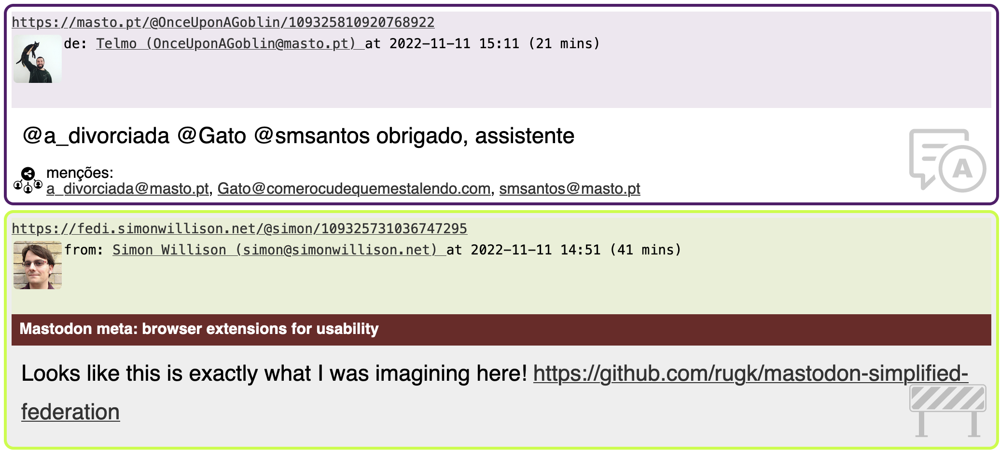

## _masto_
### a dedicated local mastodon client, using your browser or terminal

----

## Features

- shows your home timeline in a page of 4
- records reading position, ie, you will remove on the next page
- caches seen toots/statuses for the last 3 days and filters their boosts
- has simple text to speech feature. to skip to next toot press `N`
- ad hoc language detection of portuguese, falling back to english \*
- rewrites user and status URLs from instance/@person to ourInstance/@person@instance \*\*
- displays poll options
- displays content warnings (opened)

\* - many people fill the language field incorrectly  
\*\* - super useful. if you follow the link you'll be able to act on the user or toot directly without logging in


## A screenshot



```
-------
https://mastodon.social/@vostpt@trombas.vost.pt/109320004687330347
from: VOSTPT :verificado: (https://mastodon.social/@vostpt@trombas.vost.pt) at 2022-11-10T14:34:49.000Z (6 hours 7 mins)

Estamos na nossa nova casa, graças ao @Tomahock (who else?)
Obrigado ao @hugo pelo apoio dado na nossa primeira fase no Mastodon!
mentions:
* Tomahock (https://mastodon.social/@Tomahock)
* hugo@masto.pt (https://mastodon.social/@hugo@masto.pt)
media:
* https://files.mastodon.social/cache/media_attachments/files/109/320/004/600/372/509/original/308e45ca457ade58.png

-------
https://mastodon.social/@thomasfuchs/109320015478035897
from: Thomas Fuchs 🕹️🔭 (https://mastodon.social/@thomasfuchs) at 2022-11-10T14:37:36.531Z (6 hours 5 mins)

Twitter’s CISO (Chief Information Security Officer) is throwing the towel and I can’t blame them. https://twitter.com/leakissner/status/1590706305102381058?s=46&t=Rx54BFkpYPidxACw-Pzzuw
media:
* https://files.mastodon.social/media_attachments/files/109/320/014/225/578/038/original/ca1734096b484480.jpg

```

## To setup

checkout my repo:  
```
git checkout https://github.com/JosePedroDias/masto.git
```

login on your instance and add an application,  
ex: https://mastodon.social/settings/applications

create `.env` file like this (change your values):

```
BASE_URL=https://mastodon.social
ACCESS_TOKEN=REDACTED_ACCESS_TOKEN
```

```
npm install
npm run build
```


## To run the local web server

```
npm run run-server
```

visit http://127.0.0.1:3000  
refresh to get another page :)

## To run the terminal application

```
npm run-repl
```

press enter to get another page, text and enter to leave


## TODO

- fix bug in TTS skipping when not in firefox (work in progress, chrome works after a mouse event, safari doesn't yet work)
- add tests to check templates with CW and poll
- add colors to repl version
- fill in batch with more statuses after filtering out some?
- wrap URLs with their metadata? - https://github.com/jshemas/openGraphScraper
- fall back to languages other than english and portuguese? which criteria?


## REFERENCE

- https://h3poteto.github.io/megalodon/index.html
- https://developer.mozilla.org/en-US/docs/Web/API/SpeechSynthesis
- https://developer.mozilla.org/en-US/docs/Web/API/SpeechSynthesisUtterance
- https://nodejs.org/docs/latest-v18.x/api/test.html#test_running_tests_from_the_command_line
- https://developer.mozilla.org/en-US/docs/Web/JavaScript/Guide/Regular_Expressions


## CREDITS

- https://uxwing.com/barrier-icon/
- https://uxwing.com/online-survey-icon/
- https://uxwing.com/answer-icon/
- https://uxwing.com/new-product-icon/
- https://uxwing.com/coffee-icon/
- https://uxwing.com/sharing-icon/
- https://uxwing.com/pictures-icon/